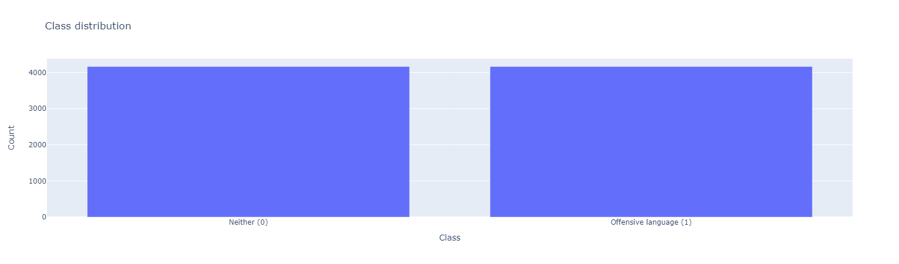
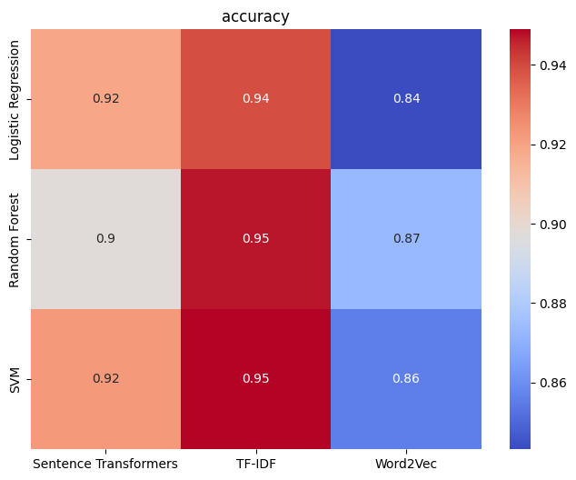
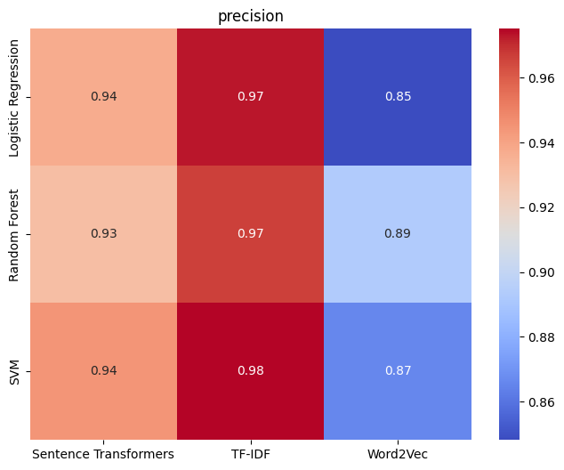
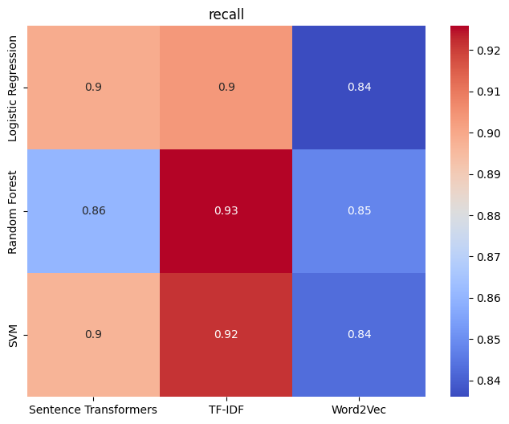
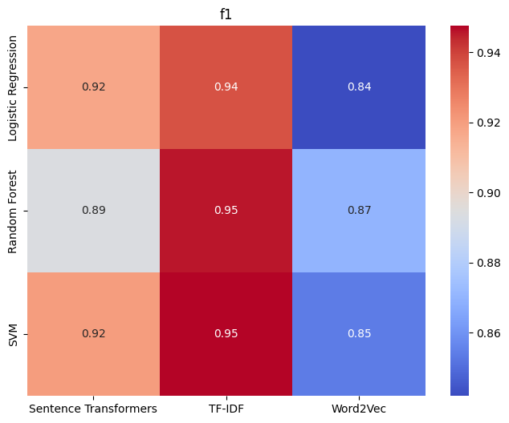

# Offensive Speech Detection Using Different Text Vectorisation Techniques

## Project Introduction
This project focuses on detecting offensive speech using various text vectorisation techniques and machine learning models. The primary objective is to compare the performance of three different vectorisation methods—TF-IDF, Word2Vec, and Sentence Transformers—on a binary classification task (offensive speech vs. non-offensive speech). The performance of these vectorisation methods is evaluated using three different classifiers: Logistic Regression, Support Vector Machine (SVM), and Random Forest.

## Data
- 8326 manually labelled tweets  
- Dataset: [Hate Speech and Offensive Language Dataset](https://www.kaggle.com/datasets/mrmorj/hate-speech-and-offensive-language-dataset) 

## Results

|                       |                     | Accuracy | Precision |  Recall  |    F1    |
|----------------------:|--------------------:|---------:|----------:|---------:|---------:|
|                TF-IDF | Logistic Regression | 0.939106 |  0.972814 | 0.903632 | 0.936859 |
|                       |                 SVM | 0.948955 |  0.975104 | 0.921582 | 0.947527 |
|                       |       Random Forest | 0.946912 |  0.966593 | 0.925818 | 0.945685 |
|              Word2Vec | Logistic Regression | 0.843141 |  0.848128 | 0.836022 | 0.841914 |
|                       |                 SVM | 0.855872 |  0.865597 | 0.842845 | 0.853873 |
|                       |       Random Forest | 0.873286 |  0.893094 | 0.848054 | 0.869846 |
| Sentence Transformers | Logistic Regression | 0.919169 |  0.937130 | 0.898897 | 0.917542 |
|                       |                 SVM | 0.922171 |  0.944822 | 0.897017 | 0.920205 |
|                       |       Random Forest | 0.897670 |  0.930286 | 0.860301 | 0.893745 |

### Heat Maps
| Accuracy                                            | Precision                                           | 
| --------------------------------------------------- | --------------------------------------------------- | 
|     |   | 

| Recall                                              | F1                                                  |
| --------------------------------------------------- | --------------------------------------------------- |
|         |                 |

### Radar Charts
 
 
 

## Notebooks Overview

### `01_data_exploration_and_preprocessing.ipynb`
- Objective: This notebook is dedicated to exploring the dataset and preparing the data for further processing.
- Contents:
  - Data Loading: Load the dataset and perform initial inspections.
  - Class Distribution: Analyse the distribution of classes 
  - Data Cleaning: Handle missing values, remove usernames, and preprocess text (e.g., lowercasing, tokenisation).

### `02_feature_extraction.ipynb`
- Objective: This notebook focuses on generating the feature representations using different vectorisation methods.
- Contents:
  - TF-IDF Vectorisation: Generate TF-IDF vectors for the text data.
  - Word2Vec Embeddings: Train Word2Vec embeddings and create sentence-level vectors.
  - Sentence Transformers Embeddings: Generate embeddings using pre-trained Sentence Transformers models.
  - Saving Features: Save the generated feature matrices for later use in model training and evaluation.

### `03_model_training_and_evaluation.ipynb`
- Objective: This notebook trains and evaluates machine learning models using the different vectorisation methods.
- Contents:
  - Model Training: Train Logistic Regression, SVM, and Random Forest classifiers using TF-IDF, Word2Vec, and Sentence Transformers features.
  - Cross-Validation: Perform k-fold cross-validation to assess model performance.
  - Evaluation Metrics: Compute accuracy, precision, recall, and F1-score for each model and vectorisation method.
  - Results Storage: Store the results in a structured format for later analysis.

### `04_results_visualisation_and_interpretation.ipynb`
- Objective: This notebook visualises and interprets the results of the different models and vectorisation methods.
- Contents:
  - Radar Charts: Use radar charts to compare the performance metrics for individual classifiers or vectorisation methods.
  - Heatmaps: Generate heatmaps to visualise the performance metrics (accuracy, precision, recall, F1-score) across different vectorisation methods and classifiers.
  - Analysis: Interpret the results, highlighting the strengths and weaknesses of each approach.
